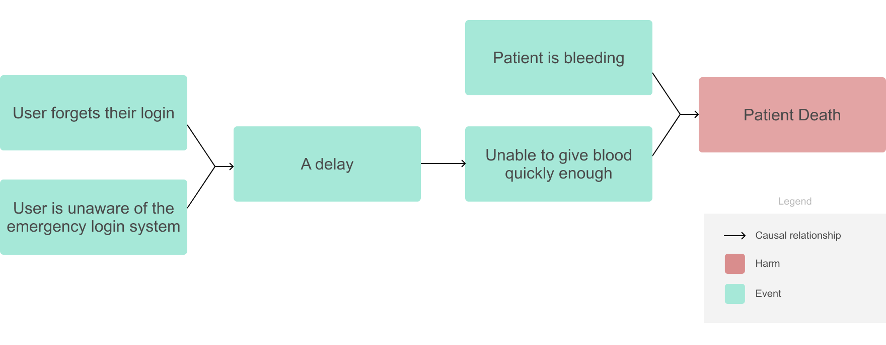

---
authors:
- J. David Giese
slug: fundamental-risk-concepts
status: Published
summary: ''
title: Fundamental Risk Concepts
---

# Introduction

Risk management is about

1.  identifying what can go wrong and estimating their likelihood and
    severity,
2.  evaluating if these risks are acceptable, and
3.  if needed, making changes to make everything acceptable.

Most software engineers already do informal risk management. For
example, you're adding the ability for users to customize their report
medical-report branding using HTML. You ask yourself: what sorts of text
could user's enter? Depending on what you come up with, you may write an
input sanitizer. On the other hand, if the page is only accessible by
company admins, you may decide sanitization isn't necessary.

The concept of risk is very general, but when working on medical devices
we usually care about the risk of injury or damage to the health of
people. Furthermore, we'll usually need to follow a formalized risk
management process that complies with the ISO 14971 standard,
"Application of risk management to medical devices."

In the rest of this article, I'll introduce the key terms and concepts
used by this standard, which are important to know if you work on
medical devices. Note that I make a few clarifying simplifications to my
definitions.

# Safety and Risk

A *harm is* injury or damage to the health of people.

A *risk* is a chain of events culminating in harm, combined with the
*probability* and *severity* of that harm. This relationship is often
encoded in tables like this:

| Probability \\ Severity | Minor Injuries | Major Injuries | Fatality      |
|-------------------------|----------------|----------------|---------------|
| Rare                    | Low Risk       | Low Risk       | Moderate Risk |
| Unlikely                | Low Risk       | Moderate Risk  | High Risk     |
| Likely                  | Moderate Risk  | High Risk      | High Risk     |

Thus, a chain of events may be high risk if it is likely, or because,
although unlikely, it would be really bad if it happened.

A device is said to be *safe* when it is free from unacceptable risk.
Note that it's okay if a medical device can cause a lot of harm if the
probability and severity of that harm is acceptable given the benefits
of using it. For example, a CT can cause cancer, but if it will diagnose
a possible brain bleed after a hard fall, the risk may be acceptable. In
this case, the CT is said to be *safe*.

# Chains of Events

What is a *chain of events*? Here is an example chain of events leading
in patient death, taken from a [public
report](https://www.accessdata.fda.gov/scripts/cdrh/cfdocs/cfmaude/detail.cfm?mdrfoi__id=9916045&pc=MMH)
sent to the FDA:

> A patient arrived at the emergency room, needing blood for an
> unspecified reason. A medical practitioner \[perhaps a nurse\]
> attempted to retrieve blood from the BLOOD TRACK v4.11.1 device but
> didn't know the correct username. They also didn't know about the
> emergency release system. By the time another user was able to login
> using the emergency release system, 5 minutes and 18 seconds had
> passed and the patient died.

This report could be converted into the following chain of events,
leading to harm:

A chain of events can involve combinations, as well as sequences, of
events. E.g., the delay was caused because the user forgot their login
*and* was unaware that there was an emergency release system.

Also note that only some of the events in the chain are directly related
to the medical device. To properly analyze risk, we need to know how a
device is used in the clinic. This means you need clinical experts on
your risk management team.

# Focus on Utility

This chain of events could be drawn in several different ways. We could
make it simpler, e.g. by combining events. It could also be made more
complete:

-   There are many downstream events that could lead to the patient
    bleeding—a fall, a stab wound, a car-accident.
-   Physiologically, there is a long chain of events in between the
    patient bleeding and the patient dieing. Similarly, the other arrows
    in our diagram could be split into smaller sub-events.
-   There may be other "causes" that aren't listed. E.g., if someone
    were available to quickly help the nurse access the system, the
    delay would have been much shorter. Should "lack of available
    assistants" be added as another cause of the delay? These tangential
    causes are sometimes referred to as *conditions*. The distinction
    between causes and conditions, however, is often unclear and isn't a
    reliable guide for deciding what should or shouldn't be included.

When deciding what to include in your risk analysis, focus on what is
useful for making your device safer.

# Hazards and Hazardous Situations

There are a couple other terms to learn. A *hazard* is a potential
source of harm. For example, a laser, heat, or bacteria. In software
devices the hazards tend to be more abstract and difficult to
distinguish from other events in the chain of events.

For example, what is the hazard in the chain of events presented
earlier? If a "source of harm" merely means a "cause of harm", then
every event is a hazard and the definition isn't very useful. The
patient will die if left alone. Is the cause of the bleeding the hazard?
Although that seems like the most correct answer, it's not very useful.
Instead, let's take it as a given that the patient is bleeding and that
giving them blood will prevent them from dyeing. Thus, we can consider
the hazard to be the delay itself. One benefit of this section is that
there are likely many chains of events that involve delays.

A *hazardous situation *is a circumstance in which people are exposed to
one or more *hazards. *The hazardous situation is the set of events just
prior to the harm. Thus, in our case the hazardous situation is that the
patient is bleeding *and *isn't being given blood quickly enough.

Note that just because a hazardous situation occurs doesn't necessarily
mean the patient will be harmed. Thus, it can be useful to distinguish
the probability of a hazardous situation arising from the probability of
a hazardous situation leading to harm. All of this can be put together
into this diagram:

# Risk Management Activities

IEC 14971 defines a three central risk management activities:

-   *Risk analysis* — identifying hazards and estimating how likely they
    are to cause harm
-   *Risk evaluation* — deciding what risks are acceptable
-   *Risk control* — reducing risks by adding *risk control measures
    *(e.g., altering the design, adding protective measures to the
    device, or providing training).

Software engineers will be especially involved in identifying risks that
have events occurring in software as well as suggesting and implementing
risk control measures in software.

Note that there are a few other activities required by ISO 14971 that
aren't included here.

# Notes from Call

Harm is not an “event”, it is the residual (or result) of some event.

E.g., a decapitation is the event. The residual is that the person was
decapitated (note past tense).

A harm can be seen and characterized.

An event can be seen and characterized.
